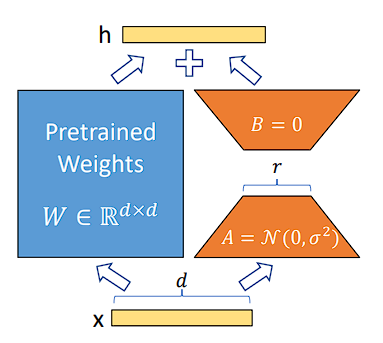
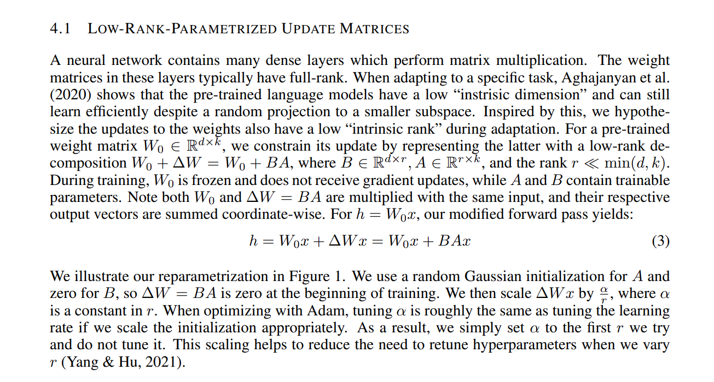

# Low-Rank Adaptation (LoRA) for Efficient Fine-Tuning

This repository demonstrates the implementation of **Low-Rank Adaptation (LoRA)**, a parameter-efficient fine-tuning method for large neural networks, using PyTorch. The project focuses on applying LoRA to fine-tune a neural network trained on the MNIST dataset.

---

## Low-Rank Adaptation (LoRA)

### Overview
LoRA is a technique designed to reduce the computational and memory overhead associated with fine-tuning large neural networks. Instead of updating all parameters, LoRA introduces low-rank matrices ( A ) and ( B ) into the weight matrices of the model. The modified weights are expressed as:
\[
W' = W + (B * A) * scale
\]
where:
- ( W ): Original weight matrix.
- ( B ) and ( A ): Low-rank matrices.
- ( scale ): A scaling factor to control the magnitude of updates.

### Key Features
1. **Parameter Efficiency**:
   - LoRA significantly reduces the number of trainable parameters during fine-tuning. In this implementation:
     - Original model parameters: ~2.8M.
     - Parameters trained by LoRA: ~6.8K (0.242% of the original parameters).

2. **Freezing Original Parameters**:
   - During fine-tuning, original model parameters are frozen, and only the low-rank matrices ( A ) and ( B ) are updated.

3. **Application**:
   - Fine-tunes the model specifically on poorly performing digits (e.g., digit 5 in MNIST).

---

## Singular Value Decomposition (SVD)

The **SVD.ipynb** notebook provides an example of matrix decomposition using Singular Value Decomposition (SVD). This technique is conceptually related to LoRA as both involve low-rank approximations. In SVD:
\[
W = U * S * V^T
\]
where ( U ), ( S ), and ( V^T ) represent orthogonal matrices and singular values. The notebook demonstrates how SVD can be used to reduce matrix dimensions while preserving essential information.

---
